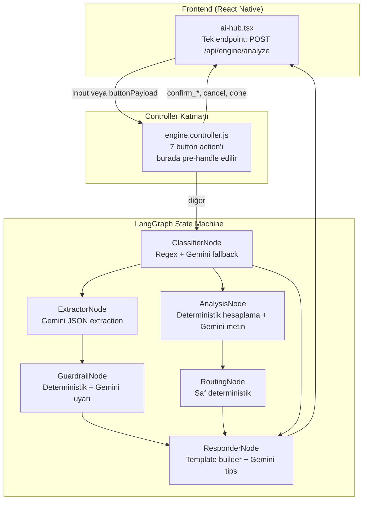
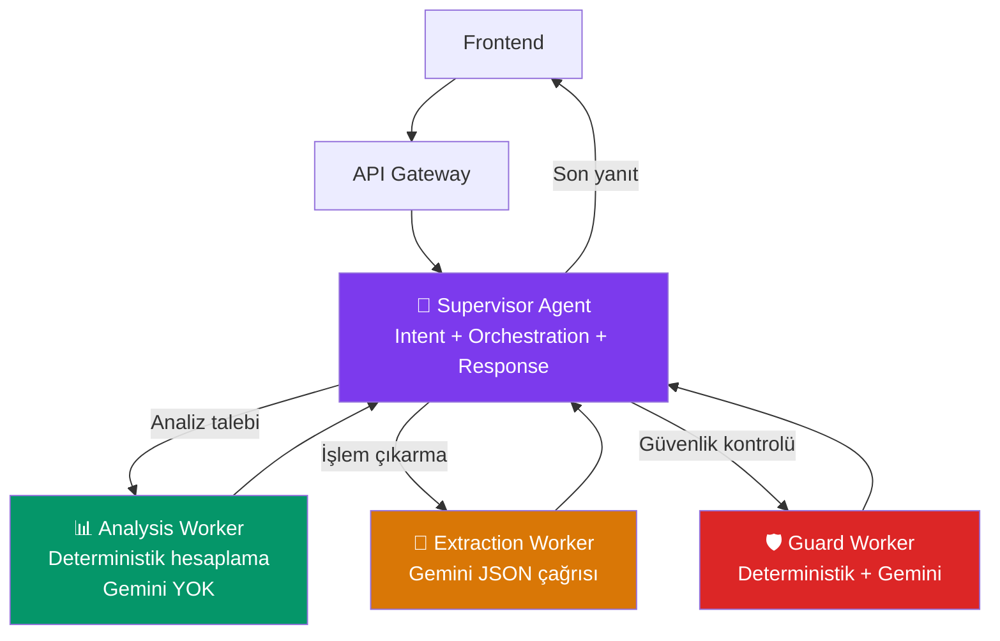
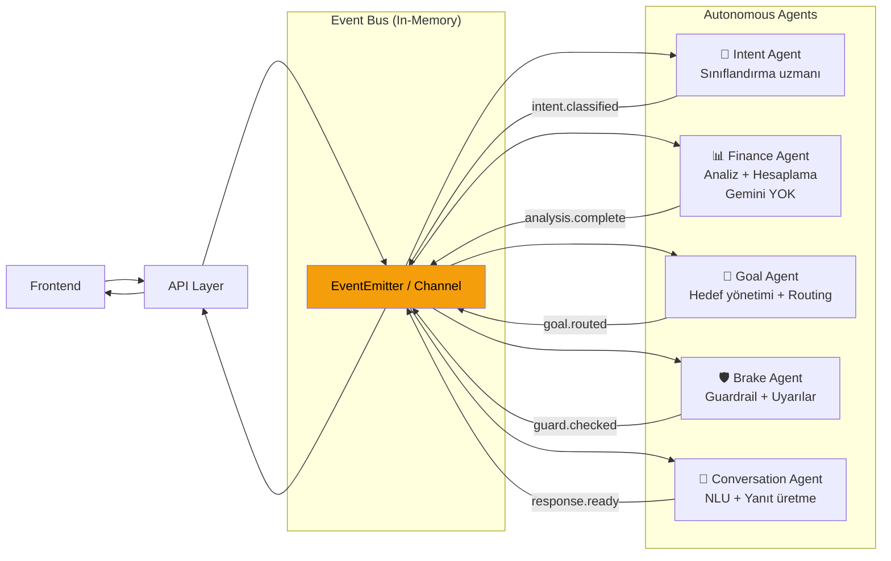
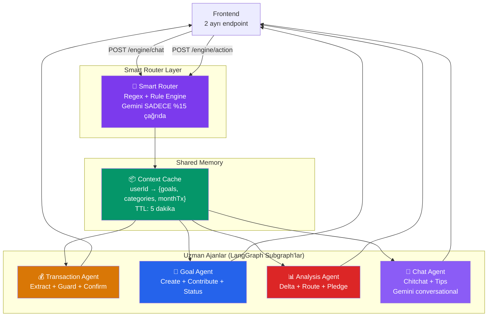

# Mind Wallet AI Mimari Analizi & Yol Haritaları

## 📍 Mevcut Durum: X-Ray Analiz

### Mevcut Agent Akışı



### 🔬 Gerçek Gemini Çağrı Haritası

Her node'un Gemini API'ye ne zaman ve neden başvurduğunu analiz ettim:

| Node | Gemini Çağrısı | Ne Zaman? | Tip |
|---|---|---|---|
| **ClassifierNode** | `generateText` | Regex fast-path başarısız olunca | Intent sınıflandırma |
| **ExtractorNode** | `generateJSON` | TRANSACTION ve GOAL_CREATION akışlarında | Veri çıkarma |
| **GuardrailNode** | `generateText` | Deterministik pre-check'ler geçilince | Uyarı metni |
| **AnalysisNode** | `generateText` | Her çalışmasında (metin cilalama) | Özet yazma |
| **RoutingNode** | ❌ Yok | — | Saf deterministik |
| **ResponderNode** | `generateText` | Sadece `get_tips` action'ında | İpucu üretme |

> [!IMPORTANT]
> **Kritik Bulgu**: Sistem aslında **tek bir Gemini modeli** (`gemini-3-flash-preview`) kullanıyor. "3 ayrı AI modeli" olarak algılanan yapı, gerçekte **6 LangGraph node'u** — bunların 5'i aynı Gemini modeline farklı prompt'larla çağrı yapıyor. Modeller arası "iş bölümü eksikliği" sorunu aslında **node sorumlulukları arasındaki sınır bulanıklığı** ve **Gemini çağrılarının gereksiz tekrarı** sorunudur.

### Tespit Edilen Sorun Haritası

#### 1. ResponderNode "God Object" Problemi
[responder.node.js](file:///c:/Users/adil/Documents/My%20Projects/mind-wallet-mobile/server/src/services/engine/nodes/responder.node.js) — **505 satır**, 15+ farklı akış dalı. Hem UI builder, hem iş mantığı, hem Gemini çağrısı yapan monolitik bir node.

#### 2. Controller-Graph Sınır Karmaşası
[engine.controller.js](file:///c:/Users/adil/Documents/My%20Projects/mind-wallet-mobile/server/src/controllers/engine.controller.js) — 7 button action controller'da işleniyor, 8 tanesi graph'a gidiyor. Bu iki katman arasındaki iş bölümü belirsiz; `confirm_pledge` controller'da, `reduce_category` graph'ta.

#### 3. Her İstek İçin Tam DB Taraması
Her `/analyze` çağrısında 4 paralel DB sorgusu çalışıyor (mevcut ay, önceki ay, hedefler, kategoriler) — **kullanıcı sadece "merhaba" dese bile**.

#### 4. Gemini Çağrı Gereksizliği
- ClassifierNode regex'le yakalayamadığı her şeyi Gemini'ye gönderiyor
- AnalysisNode her zaman metin cilalama için Gemini çağrıyor (20 RPM limitinde riskli)

#### 5. State Şişkinliği
LangGraph state'inde 23 alan var. Her node bu devasa state'i alıyor ama çoğu yalnızca 2-3 alanı kullanıyor.

---

## Yol A: Supervisor-Worker Hiyerarşisi

### Konsept
Merkezi bir **Supervisor Agent** tüm kararları veriyor. Worker'lar sadece kendilerine verilen dar görevleri yapıyor.



### Nasıl Çalışır

| Katman | Sorumluluk | Gemini Kullanımı |
|---|---|---|
| **Supervisor** | Intent sınıflandırma, worker seçimi, response oluşturma, chat history yönetimi | ✅ Tek bir "meta-prompt" ile sınıflandırma + yanıt |
| **Analysis Worker** | `computeCategoryDeltas`, `fallbackSavings`, routing hesaplaması | ❌ Tamamen deterministik |
| **Extraction Worker** | Doğal dil → yapılandırılmış veri (işlem, hedef) | ✅ `generateJSON` |
| **Guard Worker** | Pre-check'ler + koşullu uyarı | ✅ Sadece eşik aşılınca |

### Kritik Değişiklikler

1. **ClassifierNode + ResponderNode → Supervisor olarak birleşir**
   - Supervisor tek bir Gemini çağrısıyla hem intent'i belirler hem yanıtı oluşturur
   - Gemini çağrı sayısı düşer (2 çağrı → 1 çağrı)

2. **AnalysisNode + RoutingNode → Analysis Worker olarak birleşir**
   - Gemini metin cilalama kaldırılır
   - Deterministik mesajlar template'lerle oluşturulur

3. **DB Sorgularının Lazy Loading'i**
   - CHITCHAT intent'inde DB sorgusu yapılmaz
   - Sadece gerekli veriler çekilir

### 💪 Güçlü Yönler

- **Gemini çağrı sayısı %40-60 azalır** (Supervisor tek çağrıyla birden fazla iş yapar)
- **Merkezi kontrol** — akış her zaman öngörülebilir
- **Debug kolaylığı** — tüm kararlar tek noktadan geçiyor
- **Free tier uyumu** (20 RPM) — en az Gemini çağrısı yapan mimari

### ⚠️ Zayıf Yönler

- **Single point of failure** — Supervisor prompt'u çok karmaşıklaşabilir
- **Supervisor prompt bloat** — 6 farklı intent + 15+ button action = devasa prompt
- **Ölçeklenmez** — yeni özellik eklendikçe Supervisor büyür
- **LangGraph'ın güçlü yönleri (paralel dallar) kullanılmaz**

### Trade-off'lar

| Kriter | Değerlendirme |
|---|---|
| Hackathon uygunluğu | ⭐⭐⭐⭐⭐ En hızlı implement edilebilir |
| Performans | ⭐⭐⭐⭐ Gemini çağrısı minimumda |
| Ölçeklenebilirlik | ⭐⭐ Supervisor darboğaz olabilir |
| Yenilikçilik | ⭐⭐ Klasik merkezi mimari |
| Bakım kolaylığı | ⭐⭐⭐ Supervisor prompt'u zamanla bakımsız kalabilir |

---

## Yol B: Event-Driven Reactive Pipeline

### Konsept
Ajanlar birbirinden **tamamen bağımsız** çalışıyor. Bir **Event Bus** üzerinden haberleşiyorlar. Her ajan kendi domaininin uzmanı ve sadece ilgili event'lere tepki veriyor.



### Nasıl Çalışır

**Event Akışı Örneği — İşlem Kaydı:**
```
1. user.message → "Markette 250 TL harcadım"
2. IntentAgent dinliyor → intent.classified { type: TRANSACTION }
3. ConversationAgent dinliyor → extraction.needed
4. ConversationAgent Gemini çağrısı → extraction.complete { amount: 250, ... }
5. BrakeAgent dinliyor → guard.check.needed
6. BrakeAgent pre-check → guard.passed (veya guard.warning)
7. ConversationAgent → response.ready { message, buttons }
```

**Event Akışı Örneği — Analiz:**
```
1. user.message → "Bu ay nasıl gidiyorum?"
2. IntentAgent → intent.classified { type: ANALYSIS }
3. FinanceAgent dinliyor → analysis.complete { deltas, savings }
4. GoalAgent dinliyor → goal.routed { targetGoal }
5. ConversationAgent → response.ready { message, buttons }
```

### Her Agent'ın Kesin Sorumlulukları

| Agent | Domain | Dinlediği Event'ler | Ürettiği Event'ler | Gemini? |
|---|---|---|---|---|
| **Intent Agent** | Sınıflandırma | `user.message` | `intent.classified` | Regex → Gemini fallback |
| **Finance Agent** | Analiz, delta hesaplama | `intent.classified(ANALYSIS)` | `analysis.complete` | ❌ Tamamen deterministik |
| **Goal Agent** | Hedef routing, pledge | `analysis.complete`, `intent.classified(GOAL_*)` | `goal.routed`, `goal.extracted` | ❌ Deterministik |
| **Brake Agent** | Harcama koruma | `extraction.complete(EXPENSE)` | `guard.checked` | Koşullu — sadece eşik aşılınca |
| **Conversation Agent** | NLU extraction, yanıt üretme | Her `*.complete` event | `response.ready` | ✅ Ana Gemini tüketicisi |

### 💪 Güçlü Yönler

- **Gerçek iş bölümü** — her agent sadece kendi domain'ini biliyor
- **Paralel çalışma** — FinanceAgent ve GoalAgent eş zamanlı tetiklenebilir
- **Bağımsız test edilebilirlik** — her agent izole test edilebilir
- **Kolay genişletilebilirlik** — yeni agent eklemek = yeni event listener
- **Hackathon jürisine etkileyici** — agentic architecture puanı yüksek

### ⚠️ Zayıf Yönler

- **Karmaşık debug** — event chain'leri takip etmek zor
- **Event ordering sorunları** — agent'lar arası sıralama garanti değil
- **Overengineering riski** — mevcut ihtiyaçlar için fazla karmaşık
- **Latency artışı** — event zincirleri seri çalışan node'lardan yavaş olabilir
- **State management zorluğu** — paylaşılan state yerine event payload'ları ile veri taşımak hatalara açık

### Trade-off'lar

| Kriter | Değerlendirme |
|---|---|
| Hackathon uygunluğu | ⭐⭐ En uzun süren implement |
| Performans | ⭐⭐⭐ Paralel potansiyel var ama event overhead ekler |
| Ölçeklenebilirlik | ⭐⭐⭐⭐⭐ En iyi ölçeklenen mimari |
| Yenilikçilik | ⭐⭐⭐⭐⭐ Jüri için en etkileyici |
| Bakım kolaylığı | ⭐⭐⭐ İyi tanımlanmış sınırlar ama event zincirleri karmaşık |

---

## Yol C: Hibrit Akıllı Router (Önerilen)

### Konsept
Mevcut LangGraph yapısını koruyarak **akıllı optimizasyonlar** yapıyoruz. Hafif bir **Smart Router** katmanı, gereksiz Gemini çağrılarını elimine ediyor. Agent'lar belirgin rollere ayrılıyor. **Shared Memory Layer** tekrar eden DB sorgularını ortadan kaldırıyor.



### Nasıl Çalışır

#### Phase 1: Smart Router (ClassifierNode evrim geçirir)
```javascript
// Mevcut: Regex fast-path → Gemini fallback
// Yeni: 3-tier classification
//   Tier 1: Regex fast-path (CHITCHAT, GOAL_STATUS, ANALYSIS) — %60 traffic
//   Tier 2: Keyword scoring (TRANSACTION vs GOAL) — %25 traffic  
//   Tier 3: Gemini classification — %15 traffic (belirsiz mesajlar)
```

#### Phase 2: 4 Uzman Agent (LangGraph Subgraph)

**Transaction Agent** — mevcut Extractor + Guardrail birleşimi:
```
Input → Extract(Gemini JSON) → Guard(deterministik + koşullu Gemini) → Response
```

**Goal Agent** — hedef yönetiminin tamamı:
```
Input → Extract(regex + Gemini) → Validate → Response
GOAL_CREATION | GOAL_CONTRIBUTION | GOAL_STATUS → hepsi buraya
```

**Analysis Agent** — mevcut Analysis + Routing birleşimi:
```
Input → Compute(deterministik) → Route → Response(template)
Gemini çağrısı YOK — template-based Türkçe mesajlar
```

**Chat Agent** — serbest konuşma ve ipuçları:
```
CHITCHAT → Template yanıt (Gemini YOK)
get_tips → Gemini conversational
```

#### Phase 3: Shared Memory (Context Cache)

```javascript
// Her kullanıcı için 5 dk TTL cache
const contextCache = new Map();

async function getContext(userId) {
    const cached = contextCache.get(userId);
    if (cached && Date.now() - cached.ts < 300_000) return cached.data;
    
    const [goals, categories, currentTx, prevTx] = await Promise.all([...]);
    const ctx = { goals, categories, currentTx, prevTx };
    contextCache.set(userId, { data: ctx, ts: Date.now() });
    return ctx;
}
```

#### Phase 4: Frontend Endpoint Ayrımı

```
POST /engine/chat    → Doğal dil mesajları (Smart Router → Agent)
POST /engine/action  → Button payload'ları (Doğrudan controller, graph atlanır)
```

Bu ayrım şu anda zaten yarı-yapılmış (controller'daki pre-handling). Resmi hale getiriyoruz.

### Her Agent'ın Kesin Sorumluluk Matrisi

| Agent | Gemini Çağrıları | DB Erişimi | Input | Output |
|---|---|---|---|---|
| **Smart Router** | `generateText` (sadece Tier 3, ~%15) | ❌ Yok | `currentInput`, `chatHistory` | `{ targetAgent, classification }` |
| **Transaction Agent** | `generateJSON` (extraction), `generateText` (guard warning) | categories cache'den | `input`, `categories` | `{ pendingData, warning, message, buttons }` |
| **Goal Agent** | `generateJSON` (extraction, sadece fallback) | goals cache'den | `input`, `activeGoals` | `{ pendingData, message, buttons }` |
| **Analysis Agent** | ❌ Yok | tx + categories cache'den | `currentTx`, `prevTx`, `categories` | `{ deltas, savings, message, buttons }` |
| **Chat Agent** | `generateText` (sadece tips) | ❌ Yok | `input`, `action` | `{ message, buttons }` |

### 💪 Güçlü Yönler

- **Mevcut kodla %70 uyumlu** — büyük rewrite yok, evrim
- **Gemini çağrıları %50+ azalır** (Smart Router Tier 1-2 + Analysis template'leri)
- **Context Cache ile DB yükü %60 azalır** (aynı oturumda tekrar sorgu yok)
- **Her agent izole test edilebilir** (LangGraph subgraph)
- **Hackathon sunumunda güçlü** — "4 uzman agent" hikayesi net ve anlaşılır
- **ResponderNode parçalanır** — 505 satırlık monolith yok olur
- **Endpoint ayrımı** ile frontend-backend iletişimi sadeleşir

### ⚠️ Zayıf Yönler

- **Cache invalidation karmaşıklığı** — işlem eklenince cache'i temizlemek lazım
- **Subgraph yönetimi** — 4 ayrı LangGraph subgraph debugging'i
- **Migration süreci** — mevcut kodu parçalamak dikkatli refactoring gerektirir

### Trade-off'lar

| Kriter | Değerlendirme |
|---|---|
| Hackathon uygunluğu | ⭐⭐⭐⭐ İyi denge — mevcut kodu kaldıraç olarak kullanır |
| Performans | ⭐⭐⭐⭐⭐ Cache + azaltılmış Gemini çağrıları |
| Ölçeklenebilirlik | ⭐⭐⭐⭐ Subgraph'lar bağımsız büyüyebilir |
| Yenilikçilik | ⭐⭐⭐⭐ Smart Router + Context Cache ilgi çekici |
| Bakım kolaylığı | ⭐⭐⭐⭐ Net sınırlar, küçük dosyalar |

---

## Karşılaştırma Tablosu

| Kriter | Yol A: Supervisor | Yol B: Event-Driven | Yol C: Hibrit Router |
|---|---|---|---|
| **Gemini çağrı azalması** | ~%40-60 | ~%30-40 | ~%50-70 |
| **DB sorgu azalması** | ~%20 | ~%30 | ~%60 (cache) |
| **Implementasyon süresi** | 2-3 gün | 5-7 gün | 3-4 gün |
| **Mevcut kod uyumu** | %50 (büyük birleştirme) | %20 (yeni mimari) | %70 (evrim) |
| **Frontend değişikliği** | Minimal | Orta (event tabanlı) | Orta (2 endpoint) |
| **Debug kolaylığı** | ⭐⭐⭐⭐⭐ | ⭐⭐ | ⭐⭐⭐⭐ |
| **Ölçeklenebilirlik** | ⭐⭐ | ⭐⭐⭐⭐⭐ | ⭐⭐⭐⭐ |
| **Hackathon puanı** | ⭐⭐⭐ | ⭐⭐⭐⭐⭐ | ⭐⭐⭐⭐ |
| **Hız (latency)** | ⭐⭐⭐⭐⭐ | ⭐⭐⭐ | ⭐⭐⭐⭐ |
| **Risk seviyesi** | Düşük | Yüksek | Orta |

---

## Frontend-Backend İletişim Önerileri (Tüm Yollar İçin Geçerli)

### Mevcut Sorun
Frontend tek endpoint kullanıyor: `POST /api/engine/analyze`. Her şey buradan geçiyor — basit button tap'leri bile full graph'ı tetikleyebilir.

### Önerilen Çözüm

```
POST /api/engine/chat     → Doğal dil (graph çalışır)
POST /api/engine/action   → Button payloads (controller'da çözülür, graph ÇALIŞMAZ)
GET  /api/engine/context   → Cache'lenmiş kullanıcı context'i (frontend prefetch)
```

Bu ayrım her 3 yolda da uygulanabilir ve tek başına **%30 gereksiz graph invocation'ı** ortadan kaldırır.

---

## Hemen Yapılabilecek Hızlı İyileştirmeler (Yol Seçiminden Bağımsız)

Bu iyileştirmeler mevcut mimaride, hangi yolu seçerseniz seçin, hemen uygulanabilir:

### 1. Lazy DB Loading
```javascript
// Şimdi: HER istek → 4 paralel DB sorgusu
// Önerilen: Intent'e göre sorgu
if (intent === 'CHITCHAT') return; // DB sorgusu YOK
if (intent === 'GOAL_STATUS') fetchGoals(); // Sadece hedefler
if (intent === 'ANALYSIS') fetchAll(); // Hepsi gerekli
```

### 2. AnalysisNode'dan Gemini Kaldırma
```javascript
// Şimdi: generateText ile metin cilalama
// Önerilen: Template-based Türkçe mesajlar
const message = deltas.length > 0
    ? `Bu ay ${toTR(deltas[0].name)} kategorisinde ${deltas[0].delta.toLocaleString('tr-TR')} TL fazla harcadın.`
    : `Bu ay harcamaların geçen ayla benzer.`;
```

### 3. ResponderNode Parçalama
505 satırlık monolith → intent bazlı ayrı dosyalar:
```
responders/
├── transaction.responder.js    (~50 satır)
├── goal.responder.js           (~80 satır)
├── analysis.responder.js       (~60 satır)
├── chitchat.responder.js       (~20 satır)
└── common.js                   (END_BUTTONS, buildCategoryButtons)
```

---

## Sorularınızı Bekliyorum

> [!IMPORTANT]
> **Karar noktaları:**
> 1. Hangi yol sizin önceliklerinize en uygun? (Hackathon deadline'ı vs uzun vadeli vizyon)
> 2. Yol C'yi seçersek, "Hızlı İyileştirmeler" kısmını önce implement edip sonra subgraph refactoring'e geçmek ister misiniz?
> 3. Frontend tarafında 2 endpoint ayrımı yapmak sizin için kabul edilebilir mi?
> 4. Context Cache mekanizması (5 dk TTL) yerine daha agresif bir strateji (session-based, invalidation-on-write) tercih eder misiniz?
